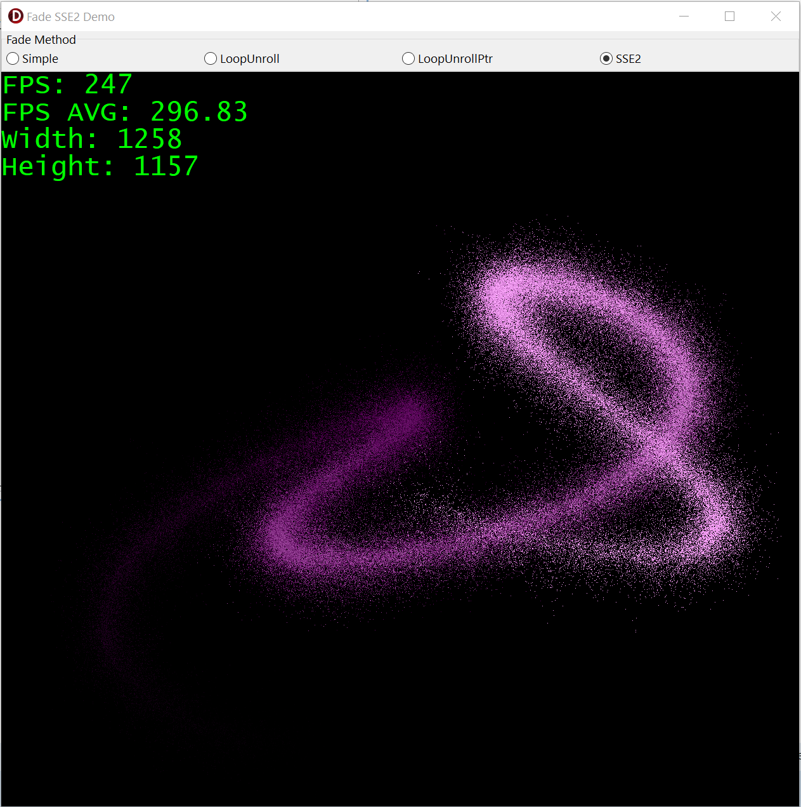

# SSE2Sample
Example of using sse2



Demo shows the difference between fade code versions and optimizations.  
Also this is an example of outputting raw pixels using the WinApi StretchDIBits function.  

[Precompiled Windows EXE (64 bit)](https://github.com/turborium/SSE2Sample/raw/main/SSE2Sample.exe)

## Results
Method | x86 (32 bit)  | x64 (64 bit) |
------ | ------------- | ------------- |
Simple | 118 FPS  | 123 FPS  |
LoopUnroll | 122 FPS  | 116 FPS  |
LoopUnrollPtr | 105 FPS | 160 FPS  |
SSE2 | 374 FPS  | 432 FPS |

For optimization purposes, the following directives are used:
```Pascal
{$POINTERMATH ON} // разрешаем работу с указателями
{$OVERFLOWCHECKS OFF} // отключаем проверку переполнения чисел
{$RANGECHECKS OFF} // отключаем проверку диапазонов
```

**Simple** code:
```Pascal
procedure FadeBufferSimple(Data: PByte; Count: Integer; Level: Byte);
var
  I: Integer;
begin
  // простой фейдинг пикселов
  for I := 0 to Count - 1 do
  begin
    Data[I] := Max(0, Data[I] - Level);
  end;
end;
```

**LoopUnroll** code:
```Pascal
procedure FadeBufferLoopUnroll(Data: PByte; Count: Integer; Level: Byte);
var
  I, ChunkCount, Index: Integer;
begin
  // считаем кол-во полных 16-байтных чанков
  ChunkCount := Count div 16;

  // фейдинг чанков используя "раскрутку цикла"
  Index := 0;
  for I := 0 to ChunkCount - 1 do
  begin
    Data[Index +  0] := Max(0, Data[Index +  0] - Level);
    Data[Index +  1] := Max(0, Data[Index +  1] - Level);
    Data[Index +  2] := Max(0, Data[Index +  2] - Level);
    Data[Index +  3] := Max(0, Data[Index +  3] - Level);
    Data[Index +  4] := Max(0, Data[Index +  4] - Level);
    Data[Index +  5] := Max(0, Data[Index +  5] - Level);
    Data[Index +  6] := Max(0, Data[Index +  6] - Level);
    Data[Index +  7] := Max(0, Data[Index +  7] - Level);
    Data[Index +  8] := Max(0, Data[Index +  8] - Level);
    Data[Index +  9] := Max(0, Data[Index +  9] - Level);
    Data[Index + 10] := Max(0, Data[Index + 10] - Level);
    Data[Index + 11] := Max(0, Data[Index + 11] - Level);
    Data[Index + 12] := Max(0, Data[Index + 12] - Level);
    Data[Index + 13] := Max(0, Data[Index + 13] - Level);
    Data[Index + 14] := Max(0, Data[Index + 14] - Level);
    Data[Index + 15] := Max(0, Data[Index + 15] - Level);

    Index := Index + 16;
  end;

  // фейдинг последнего кусочка чанка
  for I := ChunkCount * 16 to Count - 1 do
    Data[I] := Max(0, Data[I] - Level);
end;
```

**LoopUnrollPtr** code:
```Pascal
procedure FadeBufferLoopUnrollPtr(Data: PByte; Count: Integer; Level: Byte);
var
  I, ChunkCount: Integer;
begin
  // считаем кол-во полных 16-байтных чанков
  ChunkCount := Count div 16;

  // фейдинг чанков используя "раскрутку цикла" и указатели
  for I := 0 to ChunkCount - 1 do
  begin
    Data^ := Max(0, Data^ - Level); Inc(Data);
    Data^ := Max(0, Data^ - Level); Inc(Data);
    Data^ := Max(0, Data^ - Level); Inc(Data);
    Data^ := Max(0, Data^ - Level); Inc(Data);
    Data^ := Max(0, Data^ - Level); Inc(Data);
    Data^ := Max(0, Data^ - Level); Inc(Data);
    Data^ := Max(0, Data^ - Level); Inc(Data);
    Data^ := Max(0, Data^ - Level); Inc(Data);
    Data^ := Max(0, Data^ - Level); Inc(Data);
    Data^ := Max(0, Data^ - Level); Inc(Data);
    Data^ := Max(0, Data^ - Level); Inc(Data);
    Data^ := Max(0, Data^ - Level); Inc(Data);
    Data^ := Max(0, Data^ - Level); Inc(Data);
    Data^ := Max(0, Data^ - Level); Inc(Data);
    Data^ := Max(0, Data^ - Level); Inc(Data);
    Data^ := Max(0, Data^ - Level); Inc(Data);
  end;

  // фейдинг последнего кусочка чанка
  for I := ChunkCount * 16 to Count - 1 do
  begin
    Data^ := Max(0, Data^ - Level); Inc(Data);
  end;
end;
```

**SSE2** code:
```Pascal
procedure Fade16BytesSSE2(SourceVector, FadeVector: Pointer);
asm
  {$IFDEF WIN64}.NOFRAME{$ENDIF}

  // Загрузка данных из SourceVector, FadeVector в xmm0 и xmm1
  movdqu xmm0, dqword ptr [SourceVector]
  movdqu xmm1, dqword ptr [FadeVector]

  // Вычитание с насыщением (saturated subtraction)
  psubusb xmm0, xmm1

  // Запись данных из xmm0 обратно в SourceVector
  movdqu dqword ptr [SourceVector], xmm0
end;

procedure FadeBufferSSE2(Data: PByte; Count: Integer; Level: Byte);
var
  FadeVector: packed array [0..15] of Byte;
  I, ChunkCount: Integer;
begin
  // создаем вектор с 16 байтами уровня фейдинга
  for I := 0 to 16 - 1 do
    FadeVector[I] := Level;

  // считаем кол-во полных 16-байтных чанков
  ChunkCount := Count div 16;

  // фейдинг чанков используя SSE2
  for I := 0 to ChunkCount - 1 do
    Fade16BytesSSE2(@Data[I * 16], @FadeVector[0]);

  // фейдинг последнего кусочка чанка
  for I := ChunkCount * 16 to Count - 1 do
    Data[I] := Max(0, Data[I] - Level);
end;
```
